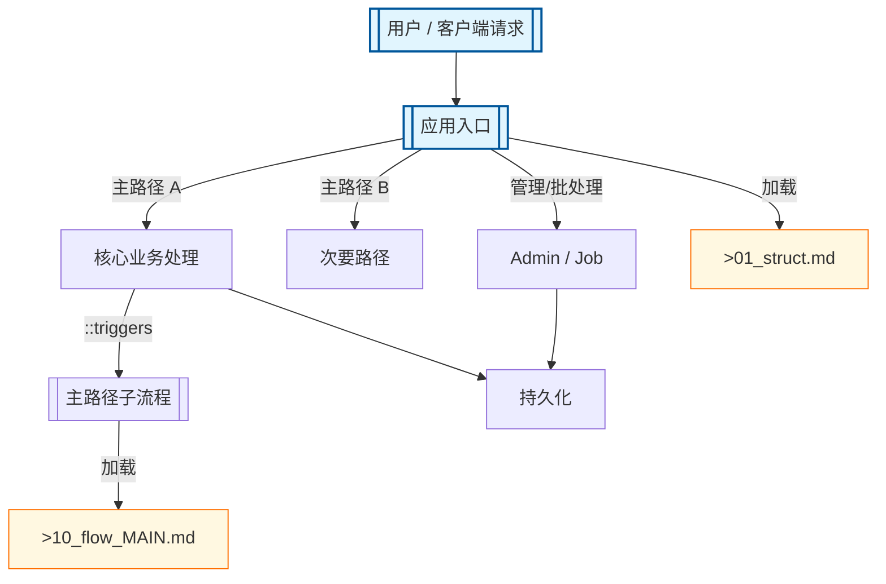

# 顶层流程总图

模板包主入口分发与典型子流程路由

## Mermaid

## Structured Data

### Nodes

| ID | Label | Kind |
|----|-------|------|
| Q | 用户 / 客户端请求 |  |
| E | 应用入口 |  |
| M1 | 核心业务处理 |  |
| M2 | 次要路径 |  |
| ADM | Admin / Job |  |
| FLOW_MAIN | 主路径子流程 |  |
| FLOW_DOC | >10_flow_MAIN.md |  |
| DB | 持久化 |  |
| STRUCT_DOC | >01_struct.md |  |

### Edges

| From | To | Mark | Type | Label | Anchors |
|------|----|------|------|-------|---------|
| Q | E | -> | depends_on | -> | 2 anchor(s) |
| E | M1 | -> | depends_on | 主路径 A | 1 anchor(s) |
| E | M2 | -> | depends_on | 主路径 B | 1 anchor(s) |
| E | ADM | -> | depends_on | 管理/批处理 | 1 anchor(s) |
| M1 | FLOW_MAIN | ::triggers | triggers |  |  |
| FLOW_MAIN | FLOW_DOC | -> | depends_on | 加载 |  |
| M1 | DB | -> | depends_on | -> | 1 anchor(s) |
| ADM | DB | -> | depends_on | -> | 1 anchor(s) |
| E | STRUCT_DOC | -> | depends_on | 加载 |  |

## Sub-graph Links

- `Struct`: [`01_struct.md`](01_struct.md)（手写 · 无 `.graph.yaml`）
- `Version`: [`02_version.md`](02_version.md)（手写 · 无 `.graph.yaml`）
- 子图编辑源见 `docs/_tech_graph/*.graph.yaml`

