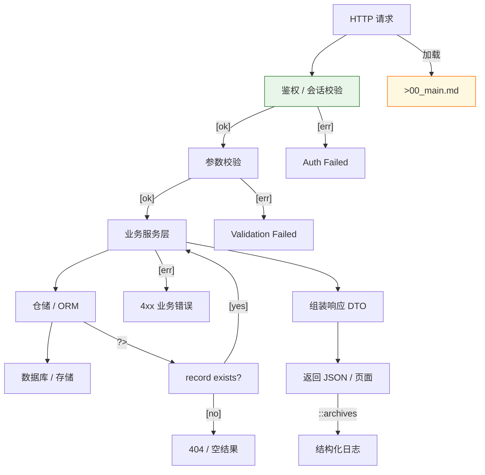

# 主路径 Flow 示例

典型 HTTP 请求从入口到响应的主干流程

## Mermaid

## Structured Data

### Nodes

| ID | Label | Kind |
|----|-------|------|
| IN | HTTP 请求 |  |
| AUTH | 鉴权 / 会话校验 |  |
| VAL | 参数校验 |  |
| SVC | 业务服务层 |  |
| ERR_AUTH | Auth Failed |  |
| ERR_VAL | Validation Failed |  |
| REPO | 仓储 / ORM |  |
| DB | 数据库 / 存储 |  |
| HIT | record exists? |  |
| NOTFOUND | 404 / 空结果 |  |
| BIZERR | 4xx 业务错误 |  |
| RESP | 组装响应 DTO |  |
| OUT | 返回 JSON / 页面 |  |
| LOG | 结构化日志 |  |
| MAIN_DOC | >00_main.md |  |

### Edges

| From | To | Mark | Type | Label | Anchors |
|------|----|------|------|-------|---------|
| IN | AUTH | -> | depends_on | -> | 1 anchor(s) |
| AUTH | VAL | -> | depends_on | [ok] |  |
| AUTH | ERR_AUTH | -> | depends_on | [err] | 1 anchor(s) |
| VAL | SVC | -> | depends_on | [ok] | 1 anchor(s) |
| VAL | ERR_VAL | -> | depends_on | [err] |  |
| SVC | REPO | -> | depends_on | -> | 1 anchor(s) |
| REPO | DB | -> | depends_on | -> | 1 anchor(s) |
| REPO | HIT | ?> | condition | ?> |  |
| HIT | NOTFOUND | -> | depends_on | [no] |  |
| HIT | SVC | -> | depends_on | [yes] |  |
| SVC | BIZERR | -> | depends_on | [err] | 1 anchor(s) |
| SVC | RESP | -> | depends_on | -> |  |
| RESP | OUT | -> | depends_on | -> | 1 anchor(s) |
| OUT | LOG | ::archives | archives |  | 1 anchor(s) |
| IN | MAIN_DOC | -> | depends_on | 加载 |  |
