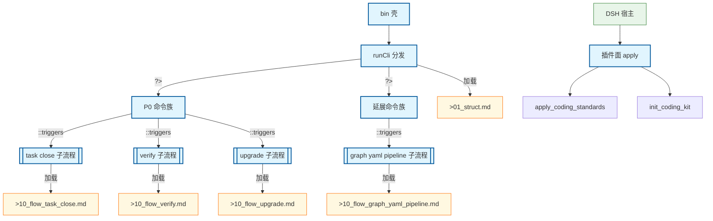

# kit 顶层流程：CLI 分发与插件面

bin 壳 → runCli 分发 → P0 命令族 / 延展命令族；并行 DSH 插件面（apply_coding_standards / init_coding_kit）。两面互不 import。L2 子流程不在本图展开。

## Mermaid

## Structured Data

### Nodes

| ID | Label | Kind |
|----|-------|------|
| BIN | bin 壳 | flow |
| RUNCLI | runCli 分发 | flow |
| P0_CMDS | P0 命令族 | flow |
| EXT_CMDS | 延展命令族 | flow |
| HOST | DSH 宿主 | external |
| PLUGIN | 插件面 apply | flow |
| APPLY_STD | apply_coding_standards |  |
| INIT_KIT | init_coding_kit |  |
| FLOW_TASK_CLOSE | task close 子流程 | flow |
| FLOW_VERIFY | verify 子流程 | flow |
| FLOW_UPGRADE | upgrade 子流程 | flow |
| FLOW_GRAPH_YAML | graph yaml pipeline 子流程 | flow |
| DOC_STRUCT | >01_struct.md | struct |
| DOC_CLOSE | >10_flow_task_close.md | struct |
| DOC_VERIFY | >10_flow_verify.md | struct |
| DOC_UPGRADE | >10_flow_upgrade.md | struct |
| DOC_GRAPH | >10_flow_graph_yaml_pipeline.md | struct |

### Edges

| From | To | Mark | Type | Label | Anchors |
|------|----|------|------|-------|---------|
| BIN | RUNCLI | -> | depends_on | -> | 1 anchor(s) |
| RUNCLI | P0_CMDS | ?> | condition | ?> | 1 anchor(s) |
| RUNCLI | EXT_CMDS | ?> | condition | ?> | 1 anchor(s) |
| P0_CMDS | FLOW_TASK_CLOSE | ::triggers | triggers |  | 1 anchor(s) |
| P0_CMDS | FLOW_VERIFY | ::triggers | triggers |  | 1 anchor(s) |
| P0_CMDS | FLOW_UPGRADE | ::triggers | triggers |  | 1 anchor(s) |
| EXT_CMDS | FLOW_GRAPH_YAML | ::triggers | triggers |  | 1 anchor(s) |
| FLOW_TASK_CLOSE | DOC_CLOSE | -> | depends_on | 加载 |  |
| FLOW_VERIFY | DOC_VERIFY | -> | depends_on | 加载 |  |
| FLOW_UPGRADE | DOC_UPGRADE | -> | depends_on | 加载 |  |
| FLOW_GRAPH_YAML | DOC_GRAPH | -> | depends_on | 加载 |  |
| RUNCLI | DOC_STRUCT | -> | depends_on | 加载 |  |
| HOST | PLUGIN | -> | depends_on | -> | 1 anchor(s) |
| PLUGIN | APPLY_STD | -> | depends_on | -> | 1 anchor(s) |
| PLUGIN | INIT_KIT | -> | depends_on | -> | 1 anchor(s) |

## Sub-graph Links

- `Struct`: [`01_struct.md`](01_struct.md)（手写 · 无 `.graph.yaml`）
- `Version`: [`02_version.md`](02_version.md)（手写 · 无 `.graph.yaml`）
- 子图编辑源见 `docs/_tech_graph/*.graph.yaml`

