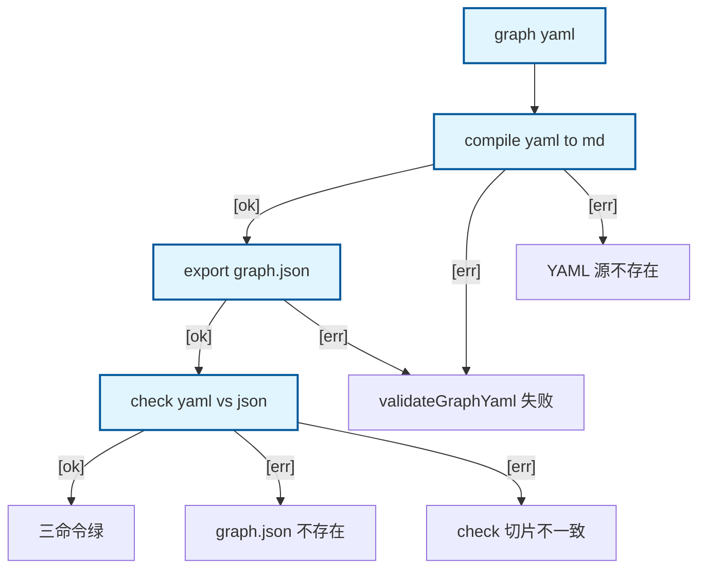

# graph yaml pipeline：compile → export → check 自指

自指 dogfood：本图描绘的正是 graph yaml compile → export → check 三条命令。Happy Path 按推荐顺序串联；单条命令失败走侧链。

## Mermaid

## Structured Data

### Nodes

| ID | Label | Kind |
|----|-------|------|
| IN | graph yaml | flow |
| COMPILE | compile yaml to md | flow |
| EXPORT | export graph.json | flow |
| CHECK | check yaml vs json | flow |
| OK | 三命令绿 |  |
| ERR_VALIDATE | validateGraphYaml 失败 |  |
| ERR_NO_YAML | YAML 源不存在 |  |
| ERR_NO_JSON | graph.json 不存在 |  |
| ERR_DIFF | check 切片不一致 |  |

### Edges

| From | To | Mark | Type | Label | Anchors |
|------|----|------|------|-------|---------|
| IN | COMPILE | -> | depends_on | -> | 2 anchor(s) |
| COMPILE | EXPORT | -> | depends_on | [ok] | 1 anchor(s) |
| COMPILE | ERR_VALIDATE | -> | depends_on | [err] | 1 anchor(s) |
| COMPILE | ERR_NO_YAML | -> | depends_on | [err] | 1 anchor(s) |
| EXPORT | CHECK | -> | depends_on | [ok] | 1 anchor(s) |
| EXPORT | ERR_VALIDATE | -> | depends_on | [err] | 1 anchor(s) |
| CHECK | OK | -> | depends_on | [ok] | 1 anchor(s) |
| CHECK | ERR_NO_JSON | -> | depends_on | [err] | 1 anchor(s) |
| CHECK | ERR_DIFF | -> | depends_on | [err] | 1 anchor(s) |
