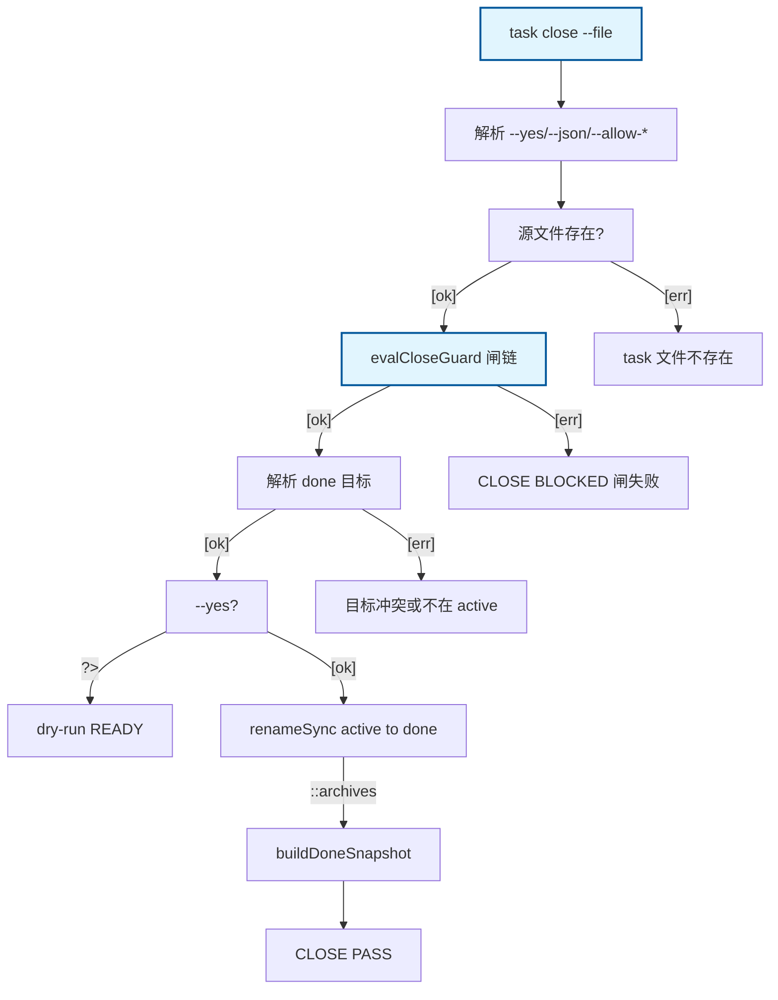

# task close：闸链 + --yes rename + done 快照

cmdTaskClose Happy Path：解析 --file → evalCloseGuard 闸链 → 解析 done 目标 → 无 --yes 则 dry-run READY；--yes 则 renameSync 后 buildDoneSnapshot。异常侧链 BLOCKED。

## Mermaid

## Structured Data

### Nodes

| ID | Label | Kind |
|----|-------|------|
| IN | task close --file | flow |
| PARSE | 解析 --yes/--json/--allow-* |  |
| FILE | 源文件存在? |  |
| GUARDS | evalCloseGuard 闸链 | flow |
| DEST | 解析 done 目标 |  |
| YES | --yes? |  |
| DRY | dry-run READY |  |
| MV | renameSync active to done |  |
| SNAP | buildDoneSnapshot |  |
| PASS | CLOSE PASS |  |
| ERR_NOFILE | task 文件不存在 |  |
| ERR_BLOCKED | CLOSE BLOCKED 闸失败 |  |
| ERR_DEST | 目标冲突或不在 active |  |

### Edges

| From | To | Mark | Type | Label | Anchors |
|------|----|------|------|-------|---------|
| IN | PARSE | -> | depends_on | -> | 1 anchor(s) |
| PARSE | FILE | -> | depends_on | -> | 1 anchor(s) |
| FILE | GUARDS | ::gates | gates | [ok] | 1 anchor(s) |
| FILE | ERR_NOFILE | -> | depends_on | [err] | 1 anchor(s) |
| GUARDS | DEST | -> | depends_on | [ok] | 1 anchor(s) |
| GUARDS | ERR_BLOCKED | -> | depends_on | [err] | 1 anchor(s) |
| DEST | YES | -> | depends_on | [ok] | 1 anchor(s) |
| DEST | ERR_DEST | -> | depends_on | [err] | 1 anchor(s) |
| YES | DRY | ?> | condition | ?> | 1 anchor(s) |
| YES | MV | -> | depends_on | [ok] | 1 anchor(s) |
| MV | SNAP | ::archives | archives |  | 1 anchor(s) |
| SNAP | PASS | -> | depends_on | -> | 1 anchor(s) |
