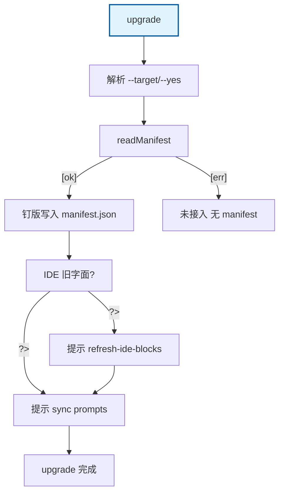

# upgrade：manifest 钉版幂等 + 提示 sync prompts

cmdUpgrade Happy Path：读 .cyning-harness/manifest.json → 写入当前包版本（同版本再跑仍成功，from_version 保留）→ 提示 sync prompts。无 manifest 侧链失败。IDE 旧字面仅为提示，不改 exit。

## Mermaid

## Structured Data

### Nodes

| ID | Label | Kind |
|----|-------|------|
| IN | upgrade | flow |
| PARSE | 解析 --target/--yes |  |
| READ_MF | readManifest |  |
| PIN | 钉版写入 manifest.json |  |
| STALE_Q | IDE 旧字面? |  |
| HINT_IDE | 提示 refresh-ide-blocks |  |
| HINT_SYNC | 提示 sync prompts |  |
| DONE | upgrade 完成 |  |
| ERR_NO_MF | 未接入 无 manifest |  |

### Edges

| From | To | Mark | Type | Label | Anchors |
|------|----|------|------|-------|---------|
| IN | PARSE | -> | depends_on | -> | 1 anchor(s) |
| PARSE | READ_MF | -> | depends_on | -> | 1 anchor(s) |
| READ_MF | PIN | -> | depends_on | [ok] | 1 anchor(s) |
| READ_MF | ERR_NO_MF | -> | depends_on | [err] | 1 anchor(s) |
| PIN | STALE_Q | -> | depends_on | -> | 1 anchor(s) |
| STALE_Q | HINT_IDE | ?> | condition | ?> | 1 anchor(s) |
| STALE_Q | HINT_SYNC | ?> | condition | ?> | 1 anchor(s) |
| HINT_IDE | HINT_SYNC | -> | depends_on | -> | 1 anchor(s) |
| HINT_SYNC | DONE | -> | depends_on | -> | 1 anchor(s) |
