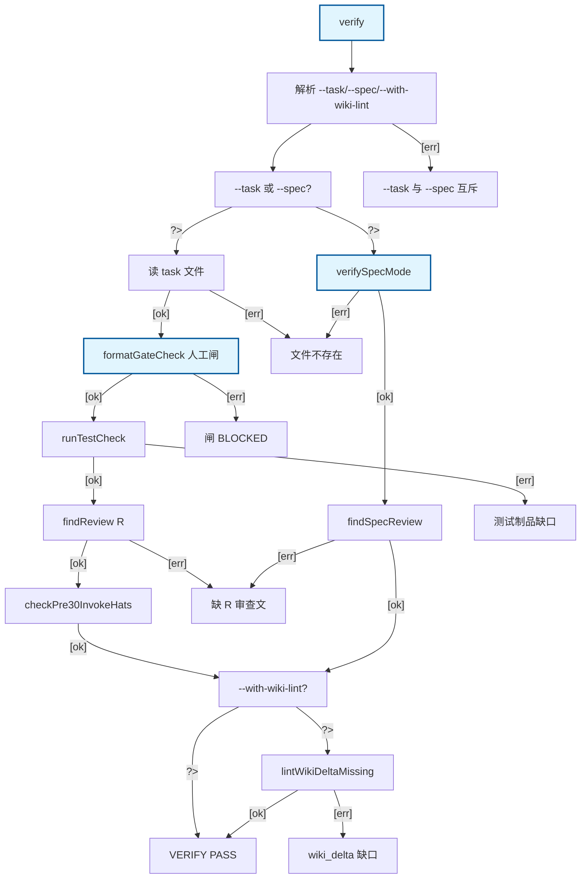

# verify：--task / --spec / --with-wiki-lint

cmdVerify Happy Path：--task 与 --spec 互斥；--task 走闸/测试/R<n> 审/pre-30 hats；--spec 走 findSpecReview（可 skip_spec_audit）；--with-wiki-lint 追加 lintWikiDeltaMissing。异常侧链 BLOCKED。

## Mermaid

## Structured Data

### Nodes

| ID | Label | Kind |
|----|-------|------|
| IN | verify | flow |
| PARSE | 解析 --task/--spec/--with-wiki-lint |  |
| MODE | --task 或 --spec? |  |
| TASK | 读 task 文件 |  |
| GATES | formatGateCheck 人工闸 | flow |
| TEST | runTestCheck |  |
| REVIEW | findReview R<n> |  |
| HATS | checkPre30InvokeHats |  |
| SPEC | verifySpecMode | flow |
| SPEC_REVIEW | findSpecReview |  |
| WIKI_Q | --with-wiki-lint? |  |
| WIKI | lintWikiDeltaMissing |  |
| PASS | VERIFY PASS |  |
| ERR_MUTEX | --task 与 --spec 互斥 |  |
| ERR_NOFILE | 文件不存在 |  |
| ERR_GATE | 闸 BLOCKED |  |
| ERR_TEST | 测试制品缺口 |  |
| ERR_REVIEW | 缺 R<n> 审查文 |  |
| ERR_WIKI | wiki_delta 缺口 |  |

### Edges

| From | To | Mark | Type | Label | Anchors |
|------|----|------|------|-------|---------|
| IN | PARSE | -> | depends_on | -> | 1 anchor(s) |
| PARSE | MODE | -> | depends_on | -> | 1 anchor(s) |
| PARSE | ERR_MUTEX | -> | depends_on | [err] | 1 anchor(s) |
| MODE | TASK | ?> | condition | ?> | 1 anchor(s) |
| MODE | SPEC | ?> | condition | ?> | 1 anchor(s) |
| TASK | GATES | ::gates | gates | [ok] | 1 anchor(s) |
| TASK | ERR_NOFILE | -> | depends_on | [err] | 1 anchor(s) |
| GATES | TEST | -> | depends_on | [ok] | 1 anchor(s) |
| GATES | ERR_GATE | -> | depends_on | [err] | 1 anchor(s) |
| TEST | REVIEW | -> | depends_on | [ok] | 1 anchor(s) |
| TEST | ERR_TEST | -> | depends_on | [err] | 1 anchor(s) |
| REVIEW | HATS | -> | depends_on | [ok] | 1 anchor(s) |
| REVIEW | ERR_REVIEW | -> | depends_on | [err] | 1 anchor(s) |
| HATS | WIKI_Q | -> | depends_on | [ok] | 1 anchor(s) |
| SPEC | SPEC_REVIEW | -> | depends_on | [ok] | 1 anchor(s) |
| SPEC | ERR_NOFILE | -> | depends_on | [err] | 1 anchor(s) |
| SPEC_REVIEW | WIKI_Q | -> | depends_on | [ok] | 1 anchor(s) |
| SPEC_REVIEW | ERR_REVIEW | -> | depends_on | [err] | 1 anchor(s) |
| WIKI_Q | PASS | ?> | condition | ?> | 1 anchor(s) |
| WIKI_Q | WIKI | ?> | condition | ?> | 1 anchor(s) |
| WIKI | PASS | -> | depends_on | [ok] | 1 anchor(s) |
| WIKI | ERR_WIKI | -> | depends_on | [err] | 1 anchor(s) |
