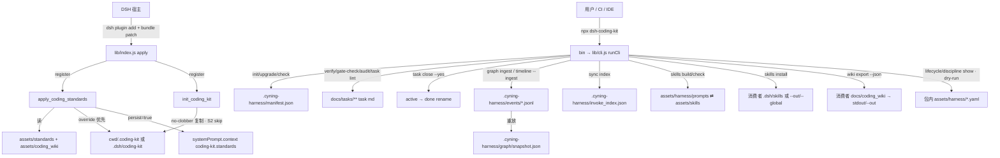

> **历史锚**：dsh-coding-kit **1.2.2**
> **原工作区路径**：`docs/dsh_coding_kit_optimization/00_inventory/architecture.md`
> **非现行真值** · 现行 L1 见 `docs/_tech_graph/01_struct.md`

# 架构与数据流 · dsh-coding-kit@1.2.2（R1 起草）

> **真值**：`dsh-coding-kit/src/`（13 个 .ts，约 4.0k 行）与 `lib/`（tsc 编译产物，.js + .d.ts + .js.map）。tsconfig：target ES2020 · module Node16 · strict · declaration+sourceMap（tsconfig.json）。运行要求 Node ^22.19 || >=24（package.json#37-39）。

## 1. 分层

```
bin/dsh-coding-kit.js        # 7 行壳：import lib/cli.js 的 runCli；按 CliError.exitCode 退出
└─ lib/cli.js (src/cli.ts)   # 命令分发 runCli + P0（init/upgrade/check/verify/gate-check/audit/task lint|close）
   ├─ cli-shared.ts          # CliError/fail、takeOption、resolveTarget、Harness 元信息/人工闸解析、slug 工具
   ├─ cli-status.ts          # status / timeline 入口（timeline 实现委托 cli-timeline.ts）
   ├─ cli-timeline.ts        # buildTaskTimeline / formatTimelineHuman
   ├─ cli-lifecycle.ts       # lifecycle show|dry-run · discipline show（读包内 assets yaml）
   ├─ cli-graph.ts           # graph 子命令路由（yaml / ingest / snapshot / axioms）
   ├─ cli-graph-yaml.ts      # inform_graph.v3 校验、YAML→MD 编译、graph.json export/check
   ├─ cli-graph-hgm.ts       # HGM：events JSONL、ingest 幂等、snapshot 重放、axioms
   ├─ cli-skills.ts          # skills build/check/install（frontmatter 校验、drift 闸、no-clobber 复制）
   ├─ cli-sync.ts            # sync index（invoke_index.json）
   ├─ cli-task-extra.ts      # task lint-done / lint-wiki-delta / check（sidecar schema + 环检测）
   ├─ cli-wiki.ts            # wiki export（wikilink + 相对 md 链 → harness.wiki_graph.v1）
   └─ yaml.ts                # createRequire 包 js-yaml（唯一运行时依赖，package.json#64-66）
lib/index.js (src/index.ts)  # DSH 插件面：apply(ctx) 注册 apply_coding_standards / init_coding_kit
```

- 分发：package.json files = bin / lib / assets / cordis.patch.yml / README.md / LICENSE（#22-29）；**SPEC.md 与 src/ 不进包**（D8 测试钉死，test/cli-docs-122.test.ts#67-87）。
- 构建：npm run build = tsc（src→lib）；prepare 钩子自动 build（package.json#30-36）。lib/ 在 .gitignore，属纯构建产物。

## 2. 消费者仓状态轨（.cyning-harness/ 与过程域）

| 路径 | 写入者 | 读取者 | 备注 |
|------|--------|--------|------|
| `.cyning-harness/manifest.json` | init / upgrade | check / upgrade / graph ingest | {version, preset, ide, from_version, upgraded_at}（src/cli.ts#36-42） |
| `.cyning-harness/events/YYYY-MM.jsonl` | graph ingest · timeline --ingest | loadEvents（snapshot/axioms/timeline/status） | HGM 事件追加轨，按 type:subject 幂等（src/cli-graph-hgm.ts#392-404） |
| `.cyning-harness/graph/snapshot.json` | graph snapshot | （无包内读者，供外部观测） | 事件重放产物 |
| `.cyning-harness/invoke_index.json` | sync index | （无包内读者，供外部观测） | freeze 唯一默认路径（test/cli-upgrade-compat.test.ts#183-209） |
| `.cyning-harness/profile.json` | （旧包概念） | **本包无代码读它** | 仅 adapters README 提及（DEF-020） |
| `.cyning-harness/local.json` | （旧包概念） | **本包无代码读它** | 迁移 CLOSE 债 #2 |
| `.cyning-harness/QUICKREF.md` | （旧包 init/upgrade 生成） | 人 | 本包不再生成；模板仍随包（DEF-008） |

**S2 过程域保护**：docs/tasks/ · reviews/ · invokes/by-task/ 三域。
- 插件 init_coding_kit：copyDirNoClobber 对 S2 前缀 skip（src/index.ts#13, #126-129；T5 测试）。
- CLI skills install：dest 命中 S2 → exit 1 拒写（src/cli-skills.ts#260-271, #372-374；I7 测试）。
- init/upgrade/sync index/skills build：测试以 sha256 钉死 S2 不变（test/cli-g1g7.test.ts#288-343；test/cli-upgrade-compat.test.ts#88-96）。
- HGM axioms 的 S2 公理：SYNCED 事件 files_touched 触 S2 前缀即 error（src/cli-graph-hgm.ts#363-378）——但本包不产生 SYNCED 类型事件，该公理当前无触发源（设计预留）。

## 3. 与 DSH 宿主的边界

- 插件面（入口 A）：package.json `dsh.bundle.patch` → cordis.patch.yml（- insert · id coding-kit）→ 宿主加载 → apply(ctx) 只注册 2 个工具 → 模型显式调 apply_coding_standards 才注入 systemPrompt context（name=coding-kit.standards, order=50）。加载≠注入。
- CLI 面（入口 B）：npx bin → 纯 Node 文件 IO，与 DSH 运行时零耦合；测试断言 CLI 源码不出现 ctx.tools.register（test/cli-p0.test.ts#416-425）。
- peer 契约（cordis / dsh-tools）标 optional：CLI-only 消费者可裸 npx（test/cli-peer-optional.test.ts）。

## 4. 数据流图（Mermaid）



> S2 三域（docs/tasks、reviews、invokes/by-task）在图上只被**读**；写侧全部有拒写或 no-clobber 保护（§2）。

## 5. 关键设计事实

1. **双入口互不替代**：插件面管「规范注入」，CLI 面管「过程闸」；README#9-14 明示。
2. **闸真值在 task md 的人工闸表**：parseHumanGates（src/cli-shared.ts#93-109）读 `### 人工闸` 节内 HG- 开头的表行；evaluateMayStart30（#115-129）只判 HG-AUDIT-R1 必 approved + HG-TASK-DRAFT blocks 30 + HG-GRAPH-MODULES 非 pending。
3. **状态词表**：KNOWN_STATUS_TOKENS = draft/pending/in_progress/active/deferred/done/completed（src/cli.ts#50-58）；close 只认 done/completed（#59）。
4. **事件轨 append-only**：events 按月分文件 JSONL；ingest 幂等键 type:subject，同一 task 改状态后重跑 ingest 会跳过旧 subject（GateStatusChanged 的 subject 含 gate id，不含状态值——状态变化**不**产生新事件，见 DEF-015 相关分析）。
5. **graph 双世界**：YAML→MD 编译（inform_graph.v3）与 HGM 事件图（snapshot/axioms）是两套独立图，唯一交点是 ingest 从 task md 抽闸表。
